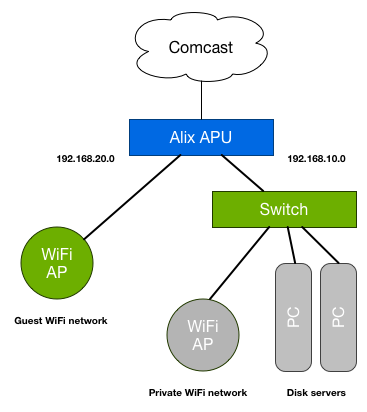
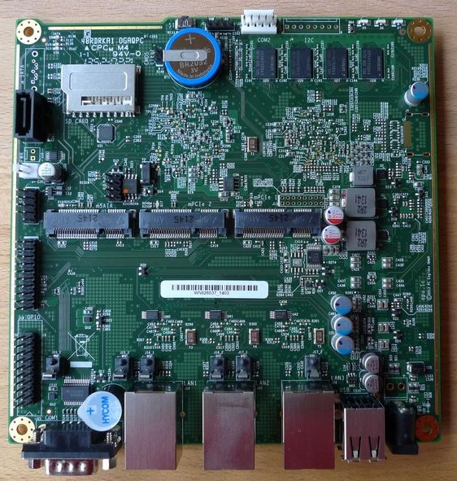

# Alix Router
Home Router

My home netowrk router is an Alix
[APU box](http://www.pcengines.ch/apu.htm) running

My home network has two networks. A private network and a Guest Netwok.

The private network is where my home servers, laptop and wife's laptop
are connected. The laptops are connected though an Apple Airport
Extreme __configured as access point__.

On the guest network are connected all the devices that I deem not
secure. Such as my guest laptops, but also the Nest Thermostat, Nest
Cam or the WEMO plugs. The guest network has no access to my private
network. All the connections are done through an old generation
Airport Extreme __configured as an access point__

All the information concerning the computer I am using for router, can
be found on the [PCEngine website](http://www.pcengines.ch/)

Example of vault.yaml
---------------------

    #
    # This file contains the secrets.
    #
    ---

    ssh_port: 22
    backup_port: 2022

    # External machines allowed to backup home.
    vultr:
      - 64.22.129.57
      - 64.22.129.58

    accounts:
      - name: fred
        gcos: Fred C.
        password: $2b$08$Bk/DAYTiGmb97UJyoewrM.flpiwru7tnsi2ekeurmdyw395leifh

    home_inventory:
      airport:
        ethernet: 80:ea:96:e5:82:1d
        address: 192.168.10.99
        comment: Airport Office

      clock:
        ethernet: 00:1b:21:08:3d:c4
        address: 192.168.10.202
        comment: Stratum 1 ntp server

      storage:
        ethernet: 00:18:8b:16:30:e2
        address: 192.168.10.213

      raspberrypi:
        ethernet: b8:27:eb:7f:60:38
        address: 192.168.10.215

      tivo-ether:
        ethernet: 00:11:d9:25:d4:85
        address: 192.168.10.251
        comment: Livingroom television
